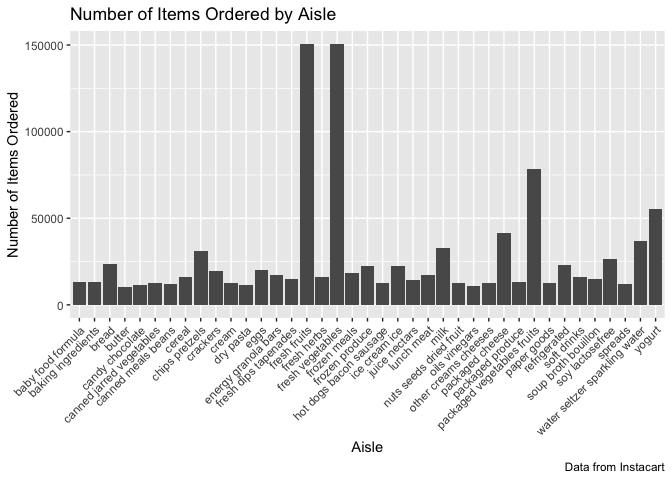

p8105\_hw3\_tal2145
================
Troy Layouni
2019-10-08

**Loading packages**

``` r
library(tidyverse)
```

    ## ── Attaching packages ───── tidyverse 1.2.1 ──

    ## ✔ ggplot2 3.2.1     ✔ purrr   0.3.2
    ## ✔ tibble  2.1.3     ✔ dplyr   0.8.3
    ## ✔ tidyr   1.0.0     ✔ stringr 1.4.0
    ## ✔ readr   1.3.1     ✔ forcats 0.4.0

    ## ── Conflicts ──────── tidyverse_conflicts() ──
    ## ✖ dplyr::filter() masks stats::filter()
    ## ✖ dplyr::lag()    masks stats::lag()

``` r
library(ggridges)
```

    ## 
    ## Attaching package: 'ggridges'

    ## The following object is masked from 'package:ggplot2':
    ## 
    ##     scale_discrete_manual

## Problem 1

**Problem 1, Part 1: Loading Instacart data**

``` r
library(p8105.datasets)
data("instacart")
```

**Problem 1, Part 2: Number of aisles and the aisle with the most items
ordered**

``` r
instacart_aisles = 
  instacart %>% 
  group_by(aisle) %>% 
  summarize(n = n()) %>% 
  arrange(desc(n)) 

instacart_aisles
```

    ## # A tibble: 134 x 2
    ##    aisle                              n
    ##    <chr>                          <int>
    ##  1 fresh vegetables              150609
    ##  2 fresh fruits                  150473
    ##  3 packaged vegetables fruits     78493
    ##  4 yogurt                         55240
    ##  5 packaged cheese                41699
    ##  6 water seltzer sparkling water  36617
    ##  7 milk                           32644
    ##  8 chips pretzels                 31269
    ##  9 soy lactosefree                26240
    ## 10 bread                          23635
    ## # … with 124 more rows

There are 134 aisles in the instacart dataset and the aisle that the
most items are ordered from is the fresh vegetables.

**Problem 1, Part 3: Plotting the number of items ordered in each aisle,
limited to aisles with more than 10,000 items ordered**

``` r
instacart_aisles %>% 
  filter(n > 10000) %>% 
  
ggplot(aes(x = aisle, y = n)) +
  geom_col() + 
  theme(axis.text.x = element_text(angle = 45, vjust = 1, hjust = 1)) +
  labs(
   title = "Number of Items Ordered by Aisle",
   x = "Aisle",
   y = "Number of Items Ordered",
   caption = "Data from Instacart"
  ) 
```

<!-- -->

**Problem 1, Part 4: Creating a table to show the 3 most popular items
from each table**

``` r
  instacart %>% 
  group_by(aisle, product_name) %>% 
  filter(aisle %in% c("baking ingredients", "dog food care", "packaged vegetables fruits")) %>% 
  summarize(n = n()) %>%
  top_n(n = 3) %>% 
  arrange(desc(n)) %>% 
  knitr::kable(caption = "3 Most Popular Items by Aisle")
```

    ## Selecting by n

| aisle                      | product\_name                                 |    n |
| :------------------------- | :-------------------------------------------- | ---: |
| packaged vegetables fruits | Organic Baby Spinach                          | 9784 |
| packaged vegetables fruits | Organic Raspberries                           | 5546 |
| packaged vegetables fruits | Organic Blueberries                           | 4966 |
| baking ingredients         | Light Brown Sugar                             |  499 |
| baking ingredients         | Pure Baking Soda                              |  387 |
| baking ingredients         | Cane Sugar                                    |  336 |
| dog food care              | Snack Sticks Chicken & Rice Recipe Dog Treats |   30 |
| dog food care              | Organix Chicken & Brown Rice Recipe           |   28 |
| dog food care              | Small Dog Biscuits                            |   26 |

3 Most Popular Items by Aisle
