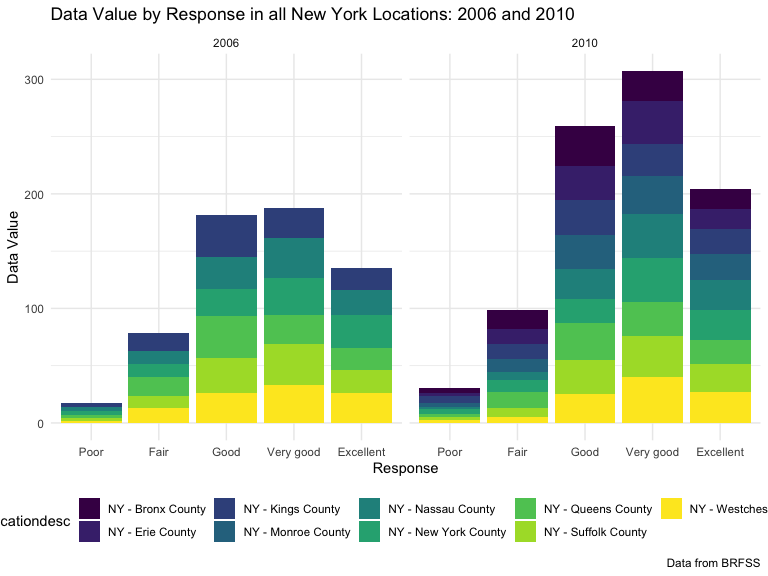

p8105\_hw3\_tal2145
================
Troy Layouni
2019-10-08

**Loading
    packages**

``` r
library(tidyverse)
```

    ## ── Attaching packages ─────────────────────────── tidyverse 1.2.1 ──

    ## ✔ ggplot2 3.2.1     ✔ purrr   0.3.2
    ## ✔ tibble  2.1.3     ✔ dplyr   0.8.3
    ## ✔ tidyr   1.0.0     ✔ stringr 1.4.0
    ## ✔ readr   1.3.1     ✔ forcats 0.4.0

    ## ── Conflicts ────────────────────────────── tidyverse_conflicts() ──
    ## ✖ dplyr::filter() masks stats::filter()
    ## ✖ dplyr::lag()    masks stats::lag()

``` r
library(ggridges)
```

    ## 
    ## Attaching package: 'ggridges'

    ## The following object is masked from 'package:ggplot2':
    ## 
    ##     scale_discrete_manual

``` r
library(viridis)
```

    ## Loading required package: viridisLite

``` r
library(lubridate)
```

    ## 
    ## Attaching package: 'lubridate'

    ## The following object is masked from 'package:base':
    ## 
    ##     date

``` r
knitr::opts_chunk$set(
    echo = TRUE,
    warning = FALSE,
    fig.width = 8, 
  fig.height = 6,
  out.width = "90%"
)
options(
  ggplot2.continuous.colour = "viridis",
  ggplot2.continuous.fill = "viridis"
)
scale_colour_discrete = scale_colour_viridis_d
scale_fill_discrete = scale_fill_viridis_d
theme_set(theme_minimal() + theme(legend.position = "bottom"))
```

## Problem 1

**Problem 1, Part 1: Loading Instacart data**

``` r
library(p8105.datasets)
data("instacart")
```

**Problem 1, Part 2: Number of aisles and the aisle with the most items
ordered**

``` r
instacart_aisles = 
  instacart %>% 
  group_by(aisle) %>% 
  summarize(n = n()) %>% 
  arrange(desc(n)) 

instacart_aisles
```

    ## # A tibble: 134 x 2
    ##    aisle                              n
    ##    <chr>                          <int>
    ##  1 fresh vegetables              150609
    ##  2 fresh fruits                  150473
    ##  3 packaged vegetables fruits     78493
    ##  4 yogurt                         55240
    ##  5 packaged cheese                41699
    ##  6 water seltzer sparkling water  36617
    ##  7 milk                           32644
    ##  8 chips pretzels                 31269
    ##  9 soy lactosefree                26240
    ## 10 bread                          23635
    ## # … with 124 more rows

There are 134 aisles in the instacart dataset and the aisle that the
most items are ordered from is the fresh vegetables.

**Problem 1, Part 3: Plotting the number of items ordered in each aisle,
limited to aisles with more than 10,000 items ordered**

``` r
instacart_aisles %>% 
  filter(n > 10000) %>% 
  mutate(aisle = reorder(aisle, n)) %>% 
  
ggplot(aes(x = aisle, y = n)) +
  geom_col() + 
  theme(axis.text.x = element_text(angle = 45, vjust = 1, hjust = 1)) +
  labs(
   title = "Number of Items Ordered by Aisle",
   x = "Aisle",
   y = "Number of Items Ordered",
   caption = "Data from Instacart"
  ) 
```


**Problem 1, Part 4: Creating a table to show the 3 most popular items
from each table**

``` r
  instacart %>% 
  group_by(product_name, aisle) %>% 
  summarize(n = n()) %>%
  #arrange(desc(n)) %>% 
  #top_n(n = 3) %>% 
  group_by(aisle) %>% 
  filter(
    aisle %in% c("baking ingredients", "dog food care", "packaged vegetables fruits"), min_rank(desc(n)) < 4) %>% 
  arrange(n, aisle) %>% 
  knitr::kable(caption = "3 Most Popular Items by Aisle")
```

| product\_name                                 | aisle                      |    n |
| :-------------------------------------------- | :------------------------- | ---: |
| Small Dog Biscuits                            | dog food care              |   26 |
| Organix Chicken & Brown Rice Recipe           | dog food care              |   28 |
| Snack Sticks Chicken & Rice Recipe Dog Treats | dog food care              |   30 |
| Cane Sugar                                    | baking ingredients         |  336 |
| Pure Baking Soda                              | baking ingredients         |  387 |
| Light Brown Sugar                             | baking ingredients         |  499 |
| Organic Blueberries                           | packaged vegetables fruits | 4966 |
| Organic Raspberries                           | packaged vegetables fruits | 5546 |
| Organic Baby Spinach                          | packaged vegetables fruits | 9784 |

3 Most Popular Items by Aisle

**Problem 1, Part 5: Creating a table for the mean hour of the day that
both Pink Lady Apples and Coffee Ice Cream are ordered each day of the
week **

``` r
instacart %>% 
    mutate(order_dow = recode(order_dow, "0" = "Sunday", "1" = "Monday", "2" = "Tuesday", "3" = "Wednesday", "4" = "Thursday", "5" = "Friday", "6" = "Saturday")) %>% 
  group_by(product_name, order_dow) %>%
  filter(product_name %in% c("Pink Lady Apples", "Coffee Ice Cream")) %>% 
  mutate(mean_hour = mean(order_hour_of_day)) %>% 
  select(product_name, order_dow, mean_hour) %>% 
  distinct() %>% 
  pivot_wider(
    names_from = "order_dow",
    values_from = c("mean_hour")
  ) %>% 
  select(product_name, Sunday, Monday, Tuesday, Wednesday, Thursday, Friday, Saturday) %>% 
  knitr::kable(caption = "Instacart: Mean Hour Products are Bought by Day of Week")
```

| product\_name    |   Sunday |   Monday |  Tuesday | Wednesday | Thursday |   Friday | Saturday |
| :--------------- | -------: | -------: | -------: | --------: | -------: | -------: | -------: |
| Pink Lady Apples | 13.44118 | 11.36000 | 11.70213 |  14.25000 | 11.55172 | 12.78431 | 11.93750 |
| Coffee Ice Cream | 13.77419 | 14.31579 | 15.38095 |  15.31818 | 15.21739 | 12.26316 | 13.83333 |

Instacart: Mean Hour Products are Bought by Day of Week

## Problem 2

**Problem 2, Part 1: Loading data and data cleaning**

  - Loading BRFSS from the `p8105.datasets` package
  - Cleaning by:
      - Formating to appropriate variable names (snake\_case)
      - Filtering to only the “Overall Health” topic
          - This includes only responses from “Excellent” to “Poor”
      - Organizing responses as a factor taking levels ordered from
        “Poor” to “Excellent”

<!-- end list -->

``` r
library(p8105.datasets)
data("brfss_smart2010")

brfss_smart2010 =
  brfss_smart2010 %>% 
  janitor::clean_names() %>% 
  filter(topic == "Overall Health") %>% 
  mutate(response = fct_relevel(as.factor(response), c("Poor", "Fair", "Good", "Very good", "Excellent"))) 
```

**Problem 2, part 2: States with 7 or more locations**

``` r
brfss_smart2010 %>% 
  filter(year == 2002) %>% 
  group_by(locationabbr) %>% 
  distinct(locationdesc) %>% 
  count(locationabbr, name = "n_locations") %>% 
  filter(n_locations > 6)
```

    ## # A tibble: 6 x 2
    ## # Groups:   locationabbr [6]
    ##   locationabbr n_locations
    ##   <chr>              <int>
    ## 1 CT                     7
    ## 2 FL                     7
    ## 3 MA                     8
    ## 4 NC                     7
    ## 5 NJ                     8
    ## 6 PA                    10

In 2002, Connecticut, Florida, Massachusetts, North Carolina, New Jersey
and Pennsylvania had at least 7 locations

``` r
brfss_smart2010 %>% 
  filter(year == 2010) %>% 
  group_by(locationabbr) %>% 
  distinct(locationdesc) %>% 
  count(locationabbr, name = "n_locations") %>% 
  filter(n_locations > 6)
```

    ## # A tibble: 14 x 2
    ## # Groups:   locationabbr [14]
    ##    locationabbr n_locations
    ##    <chr>              <int>
    ##  1 CA                    12
    ##  2 CO                     7
    ##  3 FL                    41
    ##  4 MA                     9
    ##  5 MD                    12
    ##  6 NC                    12
    ##  7 NE                    10
    ##  8 NJ                    19
    ##  9 NY                     9
    ## 10 OH                     8
    ## 11 PA                     7
    ## 12 SC                     7
    ## 13 TX                    16
    ## 14 WA                    10

In 2010 far more states had at least 7 locations which included
California, Colorado, Florida, Massachusetts, Maryland, North Carolina,
Nebraska, New Jersey, New York, Ohio, Pennsylvania,South Carolina, Texas
and Washington.

Problem 2, part 3: Constructing a new data set \* Filtered to only
include responses of “Excellent” \* Selecting variables year and state
\* Creating a variable for the averages of the `data_value` across
locations within a state

``` r
state_value_data = 
  brfss_smart2010 %>% 
  filter(response == "Excellent") %>%
  group_by(locationabbr, year) %>%
  mutate(state_value_mean = mean(data_value, na.rm = TRUE)) %>% 
  select(year, locationabbr, state_value_mean) %>% 
  distinct() 
```

Constructing a spaghetti plot of average value over time within a state

``` r
state_value_data %>% 
  group_by(locationabbr) %>% 
  
ggplot(aes(x = year, y = state_value_mean, color = locationabbr)) +
  geom_line() +
    labs(
   title = "Mean Data Value by State",
   x = "Year",
   y = "Mean Data Value",
   caption = "Data from BRFSS"
  ) 
```


**Problem 2, part 3: Making a two-panel plot showing the years 2006 and
2010 distribution of data\_vlaue for responses “Poor” to “Excellent”
among locations in New York**

``` r
brfss_smart2010 %>% 
  filter(year %in% c("2006", "2010"), locationabbr == "NY") %>%
  group_by(locationdesc, response) %>% 
  
  ggplot(aes(x = response, y = data_value, fill = locationdesc)) +
  geom_col() + 
  facet_grid(~year) +
  viridis::scale_fill_viridis(discrete = TRUE) +
      labs(
   title = "Data Value by Response in all New York Locations: 2006 and 2010",
   x = "Response",
   y = "Data Value",
   caption = "Data from BRFSS"
  ) 
```



## Problem 3

**Problem 3, part 1: Tidying accelerometer data and summarizing new
dataset**

  - creating a minute and activity count variable
  - converting minute variable to an integer type
  - creating a variable for whether a day is a weekend or weekday

<!-- end list -->

``` r
accelerometer_data = 
read_csv(file = "./data/accel_data.csv") %>%
  janitor::clean_names() %>% 
  pivot_longer(
    cols = starts_with("activity"),
    names_to = "minute",
    values_to = "activity_count",
    names_prefix = "activity_"
  ) %>% 
  mutate(minute = as.integer(minute),
         day_type = case_when(
           day %in% c("Saturday", "Sunday") ~ "weekend",
           day %in% c("Monday", "Tuesday", "Wednesday", "Thursday", "Friday") ~ "weekday",
           TRUE ~ "",
   ))
```

    ## Parsed with column specification:
    ## cols(
    ##   .default = col_double(),
    ##   day = col_character()
    ## )

    ## See spec(...) for full column specifications.

The `accelerometer_data` dataset has 6 columns that include variables
for the week, day\_id, and day of the week and minute for each
observation as well as the activity count at that day and time and
whether the observation was on a weekend or weekday. There are 50400
rows of observations for every minute of each day the subject was
monitored over the 5 weeks. The average activity level over the entire
observation period was 267.0440592. The average activity count on a
weekend was 54.1512663 less than a weekday.

**Problem 3, part 2: Creating a table of daily activity**

  - Aggregating data across minutes for each day
  - Creating table for results

<!-- end list -->

``` r
accelerometer_data %>% 
  group_by(day, week) %>% 
  mutate(daily_activity = sum(activity_count)) %>% 
  distinct(week, day, daily_activity) %>% 
  pivot_wider(
    names_from = day,
    values_from = daily_activity
  ) %>% 
  select(week, Sunday, Monday, Tuesday, Wednesday, Thursday, Friday, Saturday) %>% 
  knitr::kable(caption = "Daily Acitivity by Observation Day")
```

| week | Sunday |    Monday |  Tuesday | Wednesday | Thursday |   Friday | Saturday |
| ---: | -----: | --------: | -------: | --------: | -------: | -------: | -------: |
|    1 | 631105 |  78828.07 | 307094.2 |    340115 | 355923.6 | 480542.6 |   376254 |
|    2 | 422018 | 295431.00 | 423245.0 |    440962 | 474048.0 | 568839.0 |   607175 |
|    3 | 467052 | 685910.00 | 381507.0 |    468869 | 371230.0 | 467420.0 |   382928 |
|    4 | 260617 | 409450.00 | 319568.0 |    434460 | 340291.0 | 154049.0 |     1440 |
|    5 | 138421 | 389080.00 | 367824.0 |    445366 | 549658.0 | 620860.0 |     1440 |

Daily Acitivity by Observation Day

\*\*Problem 3, part 3: Producing a single-panel plot to show activity
per day, color coded by day of week

``` r
accelerometer_data %>% 
  #mutate(hour = floor(minute/60)) %>% 
  #group_by(day, week, hour) %>% 
  #mutate(hourly_activity = sum(activity_count)) %>% 
  #distinct(day, week, hour, hourly_activity) %>% 
  
  
  ggplot(aes(x = minute, y = activity_count, color = day)) + 
    geom_point(aes(alpha = .7)) +
  scale_x_continuous(
    breaks = c(0, 60, 120, 180, 240, 300, 360, 420, 480, 540, 600, 660, 720, 780, 840, 900, 960, 1020, 1080, 1140, 1200, 1260, 1320, 1380),
    labels = c("12:00 AM", "1:00 AM", "2:00 AM", "3:00 AM", "4:00 AM", "5:00 AM", "6:00 AM", "7:00 AM", "8:00 AM", "9:00 AM", "10:00 AM", "11:00 AM", "12:00 PM", "1:00 PM", "2:00 PM", "3:00 PM", "4:00 PM", "5:00 PM", "6:00 PM", "7:00 PM", "8:00 PM", "9:00 PM", "10:00 PM", "11:00 PM")
  ) +
    theme(axis.text.x = element_text(angle = 45, vjust = 1, hjust = 1)) +
  labs(
   title = "Activity Level Over 24 Hours",
   x = "Time",
   y = "Activity Count",
   caption = "Data from CUMC"
  ) 
```


